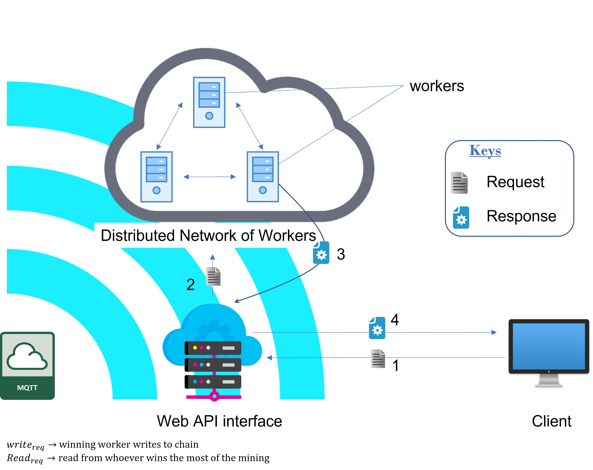
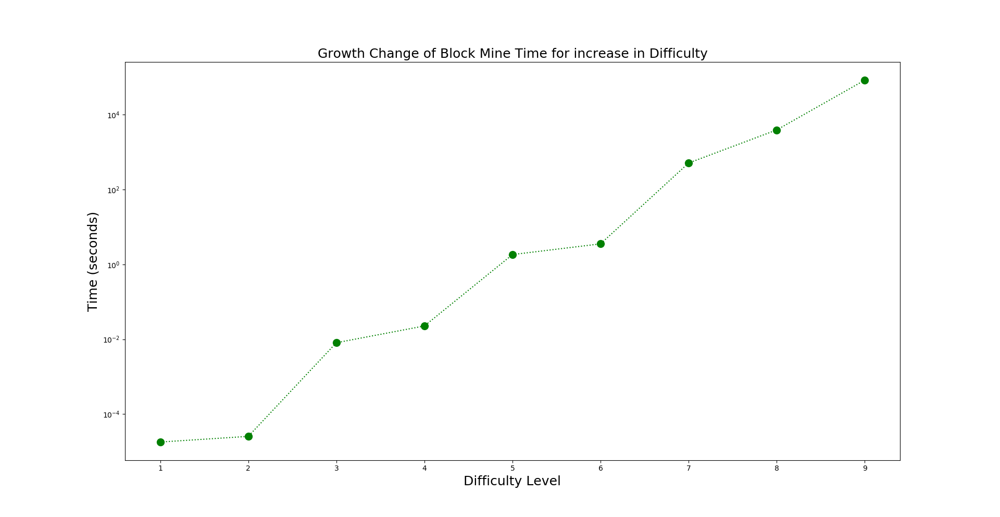

# Blockchain API
Simple blockchain api implementation with login feature

# Centralised Feasibility implementation on the root Directory
## Features
* json request and response
* supports read and write
* static smart contract feature

# Decentralised Implementation in the workers directory

## Features
* json request and response
* supports read and write

# How To Use
## Server deployment
* run the web api first
* then deploy the worker scripts on linux server
* run the mqtt server
* then start the worker scripts

## API Endpoint
Sample API python requests can be seen on `request_from_api.py`
### To Register user
```python
import requests
url = '10.1.1.1'
endpoint = '/register'
data = {"user": "john", "pw": "pass", "name": "emeka"}
requests.post(url + endpoint, json=data)

```

### To Add data
* adding data takes maximum of 5secs to be added to the blockchain ledger
```python
import requests
url = '10.1.1.1'
endpoint = '/add'
auth = ('john', 'pass')
data = {"temp": 20, "hum": 55, "time": "11:00"}
requests.post(url + endpoint, json=data, auth=auth)
```

### To read data
* when data is added it returns the hash and nonce of the data.
* this is used to read the data
* reading can be done in two methods. reading all data or reading specific data

#### Read using nonce
```python
import requests
url = '10.1.1.1'

auth = ('john', 'pass')
req1 = {"nonce": 14521}
endpoint = f'/read/{req1}'
response = requests.get(url + endpoint, auth=auth)
response.json()
```

#### Read using hash
```python
import requests
url = '10.1.1.1'

auth = ('john', 'pass')
req1 = {"hash": "7181iebdb2iqiudj2noqdn"}
endpoint = f'/read/{req1}'
response = requests.get(url + endpoint, auth=auth)
response.json()
```

#### Read all data
```python
import requests
url = '10.1.1.1'

auth = ('john', 'pass')
endpoint = '/readall'
response = requests.get(url + endpoint, auth=auth)
response.json()
```

# Experiment data

